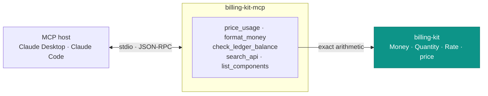

# billing-kit-mcp

An [MCP](https://modelcontextprotocol.io) server that gives an AI assistant
billing-kit's real capabilities: **exact money math**, a **double-entry balance
check**, and **discovery** of the API and the UI components.

The point is the first one. Ask a model to price 1,234,567 tokens at $0.0000012
and it will happily invent a number with `qty * rate / 100` — which is wrong for
a third of ISO 4217 and drifts on large values. This server hands the model the
number billing-kit *actually computes*, from the same `Money` type a
floating-point error can't touch.



## Tools

| Tool | What it does |
|---|---|
| `price_usage` | Multiply a quantity by a per-unit rate to an exact `Money`, with the pre-rounding value kept. **Backed by billing-kit — the number is correct, not invented.** |
| `format_money` | Format integer minor units for a currency, correctly (no `/100`; right for JPY, KWD). |
| `check_ledger_balance` | Verify a double-entry transaction's legs sum to zero per currency — the invariant billing-kit's ledger enforces. |
| `search_api` | Find billing-kit's exports and signatures — `Money`, `price`, the metering and ledger functions, the provider interface. |
| `list_components` / `get_component` | Discover the shadcn-compatible UI. Metadata and the install command only — never the (proprietary) component source. |

## Install

```sh
npm install
npm run build        # bundles to a single self-contained dist/index.js
```

The build inlines billing-kit and the data snapshots, so `dist/index.js` runs on
plain `node` with no dependency tree to ship.

## Use it from an MCP host

Add it to your host's server config. For **Claude Desktop**
(`claude_desktop_config.json`) or **Claude Code** (`.mcp.json`):

```json
{
  "mcpServers": {
    "billing-kit": {
      "command": "node",
      "args": ["/absolute/path/to/billing-kit-mcp/dist/index.js"]
    }
  }
}
```

Then ask, in plain language:

> *"With billing-kit, what does 1,234,567 tokens at a rate of 0.00012 cost in USD?"*
> → `price_usage` → **$1.48** (exact: 148.14804 minor)

> *"Do these ledger legs balance: customer_balance +19.99, revenue_accrued −19.99?"*
> → `check_ledger_balance` → **BALANCED ✓**

## How it talks

stdio, newline-delimited JSON-RPC — the host spawns the server and speaks over
stdin/stdout. Logs go to **stderr**, because anything on stdout that isn't a
protocol frame corrupts the stream.

## Tests

```sh
npm test
```

The suite drives the server through a real MCP `Client` over an in-memory
transport — the same code path a host uses — asserting that `price_usage`
returns billing-kit's exact value, `format_money` is currency-correct, and the
ledger check accepts a balanced posting and rejects an unbalanced one.

## Licence

Apache-2.0. Open on purpose — it exists to make billing-kit easier to adopt.
It reads billing-kit (Apache-2.0) directly, and reports only *metadata* about
billing-kit-components (which is proprietary and per-seat); no component source
passes through it.
