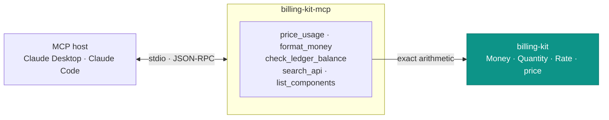
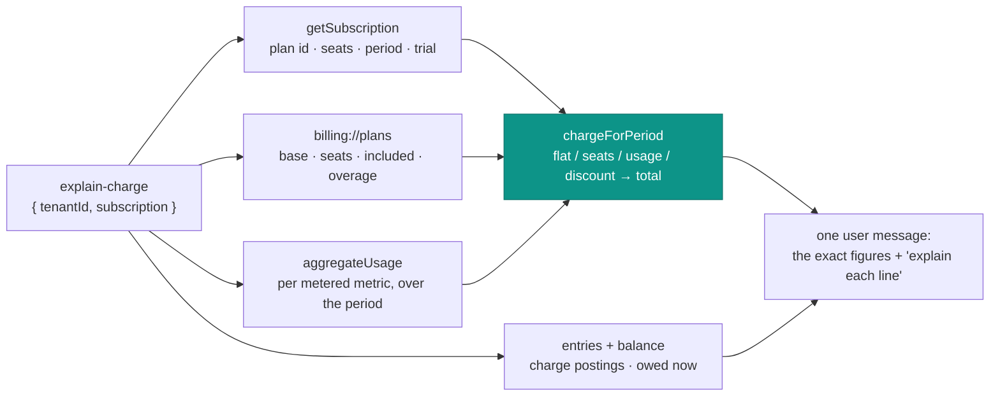
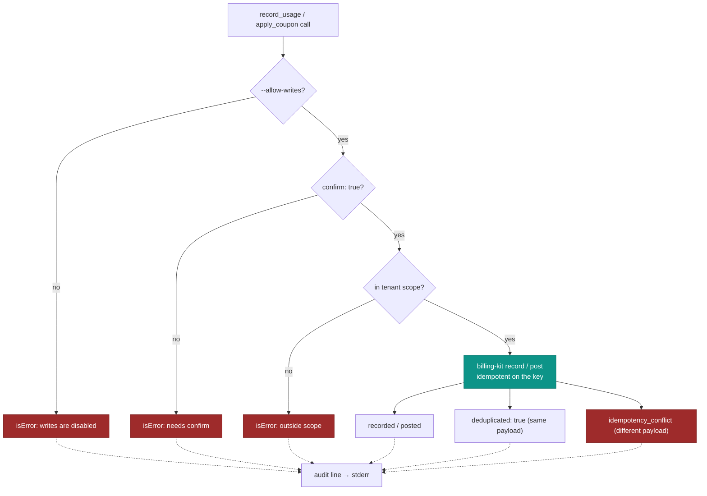
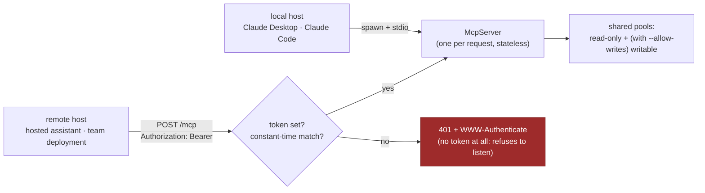
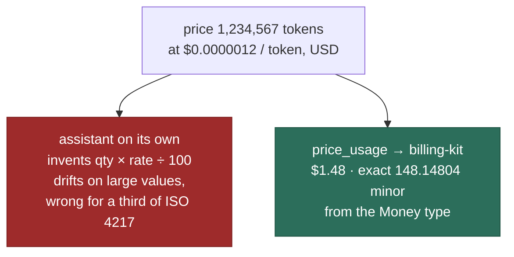

# billing-kit-mcp — diagrams

The mermaid sources for this repo. They live here rather than in the
README because npm renders no mermaid: on the package page a fence
like this one ships as raw DSL. GitHub and the QuxKit docs site both
draw them. The README carries an ASCII equivalent of each.

## The server between an MCP host and exact arithmetic



## The database-backed tools: read-only, tenant-scoped, capped

```mermaid
flowchart TB
    call["tool call<br/>{ tenantId, subjectId, ... }"]
    call --> t1{"tenantId present?"}
    t1 -- no --> e1["schema error"]
    t1 -- yes --> t2{"BILLING_KIT_MCP_TENANT<br/>set and different?"}
    t2 -- yes --> e2["isError: outside scope"]
    t2 -- no --> bk["billing-kit read function<br/>queryUsage · aggregateUsage · balance<br/>entries · walletBalance · getSubscription"]
    bk --> pool["pg.Pool<br/>SET default_transaction_read_only = on<br/>on every connection"]
    pool --> pg[("billing.* — INSERT refused")]
    classDef a fill:#0d9488,stroke:#0f766e,color:#fff
    classDef bad fill:#9e2b2b,stroke:#7f2222,color:#fff
    class bk a
    class e1,e2 bad
```

## explain-charge: what the prompt walks



## Write tools: the four guards



## Two transports: stdio by default, HTTP behind a bearer token



## Why the tool exists: an assistant guessing vs. the Money type


